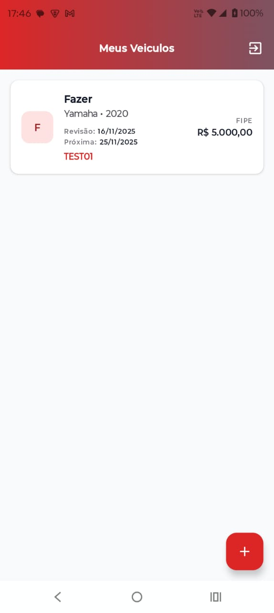
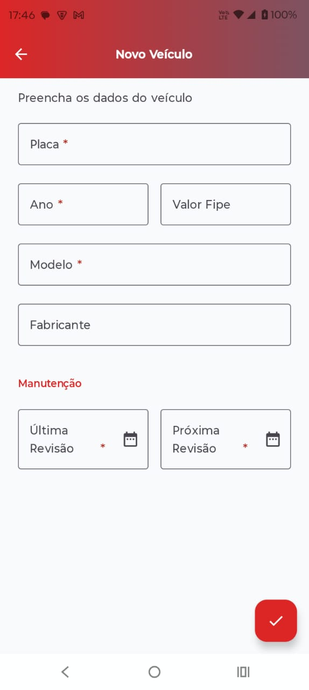

# AutoManager 🚗

Aplicativo Android nativo para gerenciamento de frota de veículos, desenvolvido como parte do desafio técnico da Sillion.

O projeto implementa um **CRUD completo** com autenticação, focado em arquitetura limpa, persistência local e sincronização remota (Offline-First).

## 📱 Funcionalidades

* **Autenticação:** Login e Cadastro de usuários (Firebase Auth).
* **Gestão de Veículos:** Cadastro, Listagem e Exclusão de veículos.
* **Offline-First:** O app funciona sem internet (salva no Room) e sincroniza quando conectado.
* **Sincronização em Tempo Real:** Dados atualizados instantaneamente via Firestore.
* **UX Aprimorada:**
    * Swipe-to-delete (arrastar para excluir).
    * Validação de formulários com feedback visual.
    * DatePickers nativos para agendamento de revisões.
    * Design moderno com Material 3 e Edge-to-Edge.

---

## 📸 Screenshots

Aqui estão algumas telas do funcionamento do aplicativo:

<div align="center">
  <table>
    <tr>
      <th style="text-align: center">Login & Auth</th>
      <th style="text-align: center">Home (Lista)</th>
      <th style="text-align: center">Cadastro de Veículo</th>
    </tr>
    <tr>
      <td align="center">
        
      </td>
      <td align="center">
        
      </td>
      <td align="center">
        
      </td>
    </tr>
  </table>
</div>

---

## 🛠 Tecnologias e Arquitetura

O projeto foi construído seguindo as melhores práticas de desenvolvimento Android moderno:

* **Linguagem:** [Kotlin](https://kotlinlang.org/) (100%).
* **Interface (UI):** [Jetpack Compose](https://developer.android.com/jetpack/compose) (Material Design 3).
    * *Por que?* Abordagem declarativa que reduz boilerplate, facilita a criação de componentes reutilizáveis (como o `VeiculoCard` e `AutoManagerTopBar`) e acelera o desenvolvimento de UI.
* **Arquitetura:** **MVVM (Model-View-ViewModel)** com princípios de **Clean Architecture**.
    * *Por que?* Separação clara de responsabilidades. A UI observa o estado (`StateFlow`) da ViewModel, que interage com Repositórios. Isso torna o código testável e escalável.
* **Injeção de Dependência:** [Hilt](https://dagger.dev/hilt/).
    * *Por que?* Padrão oficial da Google. Gerencia o ciclo de vida dos componentes (Singletons, ViewModels) e facilita a troca de implementações (ex: bancos de dados) sem acoplamento forte.
* **Persistência Local:** [Room Database](https://developer.android.com/training/data-storage/room).
    * *Por que?* Garante que o usuário possa usar o app mesmo sem internet. Atua como a "fonte única da verdade" para a UI.
* **Backend & Sincronização:** [Firebase](https://firebase.google.com/) (Firestore + Auth).
    * *Por que?* Solução robusta para autenticação segura e banco de dados NoSQL em tempo real, permitindo focar na lógica do cliente mobile.
* **Concorrência:** Coroutines & Flow.
    * *Por que?* Gerenciamento eficiente de threads (IO/Main) e fluxos de dados reativos.

---

## 🚀 Como executar o projeto

### Pré-requisitos
* Android Studio (versão Koala ou superior recomendada).
* JDK 17 configurado no Gradle.

### Passos
1.  **Clone o repositório:**
    ```bash
    git clone [https://github.com/seu-usuario/AutoManager.git](https://github.com/seu-usuario/AutoManager.git)
    ```
2.  **Abra no Android Studio:**
    Selecione a pasta raiz do projeto.
3.  **Configuração do Firebase:**
    * O arquivo `google-services.json` já está incluído no diretório `app/` para fins de teste (Modo de teste do Firestore ativado).
    * Caso deseje conectar ao seu próprio projeto Firebase, substitua o arquivo em `app/google-services.json`.
4.  **Sincronize e Execute:**
    * Aguarde o *Gradle Sync* finalizar.
    * Selecione um emulador ou dispositivo físico.
    * Clique em **Run** (▶).

---

## 📂 Estrutura de Pastas

O projeto está organizado por camadas (seguindo Clean/MVVM) e funcionalidades:

```text
com.luanferreira.automanager
├── data                # Camada de Dados
│   ├── local           # Room (DAO, Database)
│   ├── model           # Modelos de Dados (Entities)
│   └── repository      # Implementação dos Repositórios (Lógica Offline-First)
├── di                  # Módulos de Injeção de Dependência (Hilt)
├── domain              # Camada de Domínio
│   └── repository      # Interfaces (Contratos)
├── ui                  # Camada de Apresentação (Screens & ViewModels)
│   ├── auth            # Login e Cadastro
│   ├── components      # Componentes Reutilizáveis (TopBar, Cards)
│   ├── home            # Tela Principal (Listagem)
│   ├── navigation      # Grafo de Navegação e Rotas
│   ├── theme           # Tema e Cores
│   └── vehicle         # Formulário de Veículo
└── utils               # Extensões e Utilitários (Formatadores)